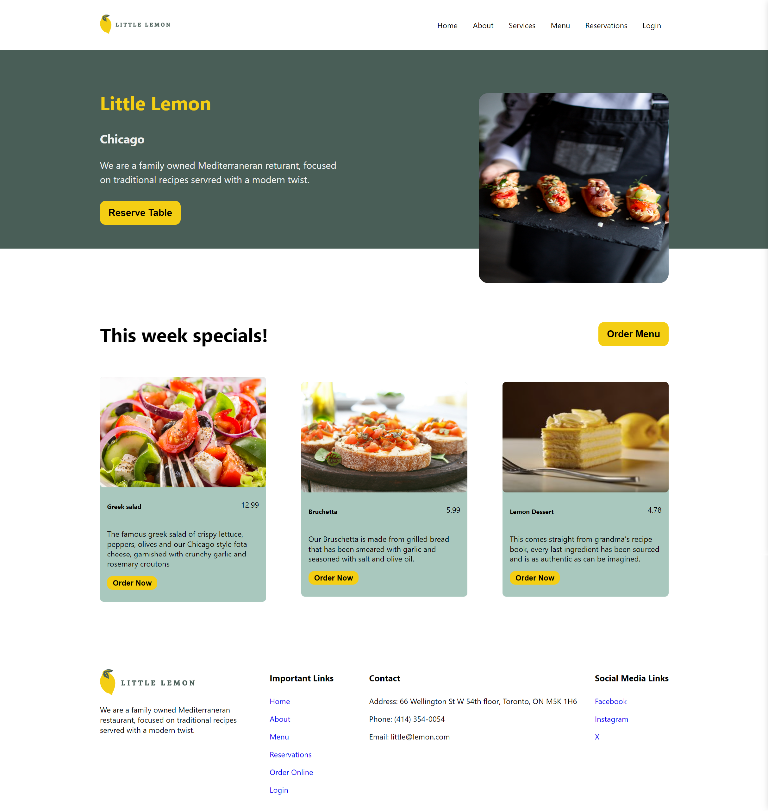
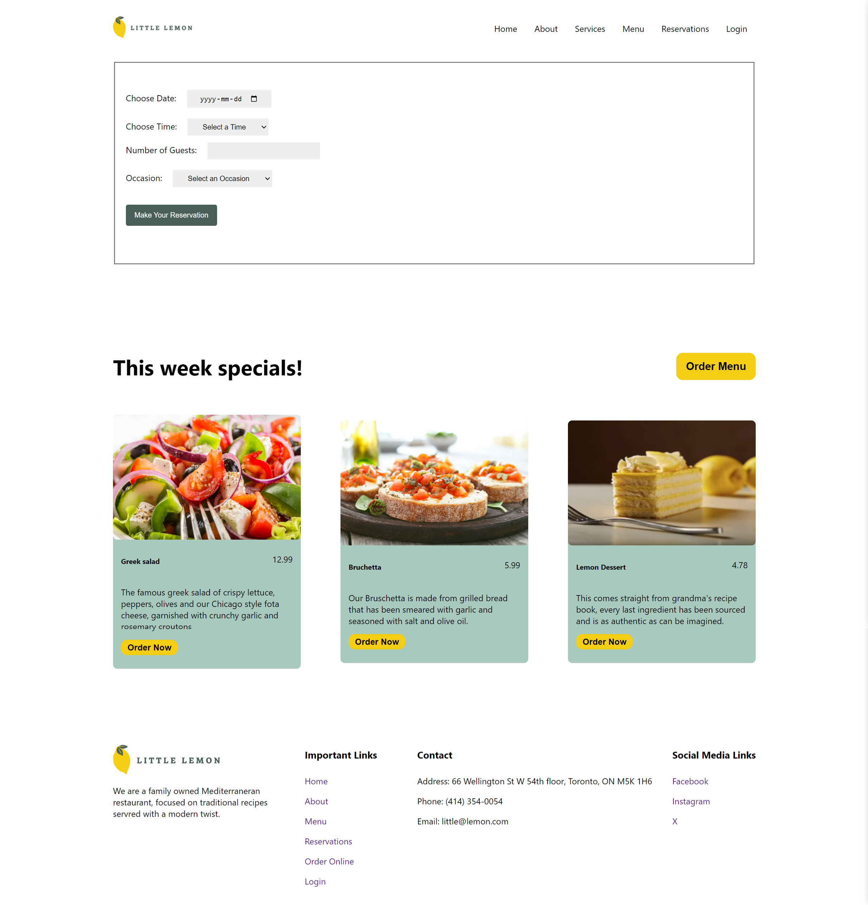

# Little Lemon Restaurant Website

## Project Description
This project was made for the capstone project of the Meta Front-End Development course on Coursera. We've need to made a functionality on this website to Reserve a Table.

Here is link to project:
https://mowmonfared.github.io/meta-app-project/

## Project Screenshot

